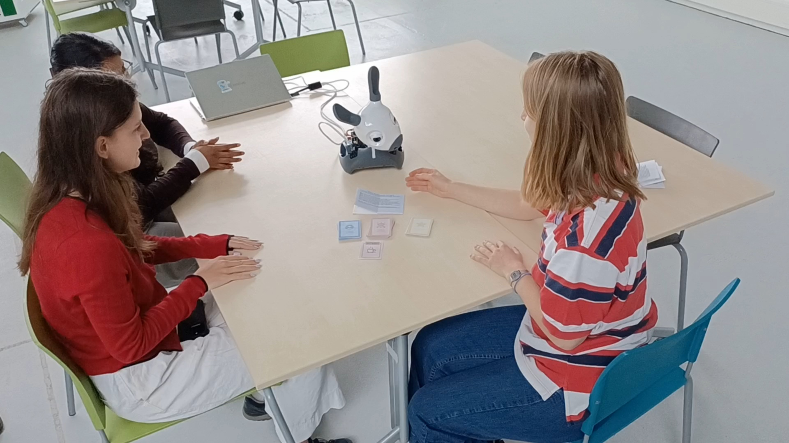

# Behaviour Design Tool - Session 6 & 7

---

## Context

Designing robot behaviour sits at the intersection of interaction design and software architecture. For a social robot like MiRo-E, behaviour is not just about what the robot does - it 
is about *when* it does it, *why*, and how that decision reads to a person in the room. Session 6 asked the group to think about what tools help a designer prototype high-level robot 
behaviour without requiring a full implementation. The constraint was productive: it pushed the group toward tools that make behaviour *discussable* before it is programmable.

This section connects directly to the [scenario design tool](scenario-design.md), because CardsAgainstRobots originated here - as a behaviour design tool idea - before being developed 
into the full card toolkit. The behaviour framing is therefore the foundation the scenario tool was built on.

---

## Tool Concept: CardsAgainstRobots as a Behaviour Prototyping Tool

The starting point for the group's behaviour tool was a simple observation: most behaviour design tools for robots either require technical knowledge (state machines, decision trees, ROS 
scripts) or are too abstract to produce testable outputs (mood boards, personas). Neither extreme is useful for a team that needs to make concrete behaviour decisions *before* 
implementation.

The group's response was to design a card-based improvisation tool that sits between the two extremes. The core idea came from a hybrid of *Cards Against Humanity* and scripted improv 
theatre: structured enough to generate specific scenarios, open enough to allow unexpected behaviour to emerge through enactment. The three card types - Human Action, Robot Action, and 
Wildcard - map directly onto the Sense-Think-Act structure that underlies most social robot behaviour architectures. The Human Action card represents the sensed input; the Robot Action 
card represents the selected response; the Wildcard represents an environmental or contextual modifier that shifts the situation mid-interaction.

The thought process behind this:
What can help you as a designer prototype (high level) robot behaviour? Especially tools that do not rely on a Wizard of Oz approach are welcome (or think of interesting hybrids. What could help you prototype and test?
Flowchart, cognitive walkthrough, cards, board, software (ARC) - recipes
Given that your phone/laptop  have sooo many capabilities (already) - how to connect / interface this to motion and embodiment? 

How make ChatGTP4.o move a servo?
Can you prompt ChatGTP to converse in a certain tone of voice, with predefined (bound) knowledge?
Design tool (ideas):
MakeYourOwnStoryboard. 
CardAgainstHumanities. Deck of prompt cards
Goal: Finding out robot (hardware) capabilities, and exploring scenarios for robot behaviour.

CardsAgainstRobots
A game you play with multiple people where the goal is to find out the robot’s
capabilities and explore topics related to the robots ‘job’ (scenarios). The robot in
question might not have the capability to do what you want it to do, or functionality might
not be appropriate to the use case. This step ensures that these are aligned. You also
explore the different scenarios (and thus its behavior) through using different types of
cards like emotion cards, actuation cards and wildcards.
In each step, the players pick one card of each to play out the scenario/ behavior.
The first and second cards are randomly selected from the corresponding card piles.
When the cards have been selected, the humans act out the scenario and puppeteer
the robot and the ways the scenario could play out with different robot interactions. This
can be physical puppeteering, or for example through the use of a controller.

Human Action | Robot Action | Wildcards |
Sits at desk frustrated | Goes to desk | *Tension*|
| Mumbling equations | "That's wrong" | *Ensue crying* |

This framing makes explicit what HRI-specific knowledge the tool embeds: the assumption that robot behaviour in a social context is always *relational* - it does not exist independently 
of what the human is doing - and that appropriate behaviour is therefore not a fixed output but a function of context. A generic software design tool (a flowchart, a decision tree) treats
behaviour as a mapping from state to action. CardsAgainstRobots treats it as an improvised negotiation between two actors, one of whom happens to be a robot.

---

## From Concept to Testable Protocol: Session 7

Session 7 was the first live test of the card toolkit with MiRo-E present and puppeteered in real time. The session produced three significant developments.

**First**, the group discovered that there was a high threshold to actually begin acting. Participants were reluctant to commit to a scenario from a standing start. The solution was to 
restructure the game opening: before drawing a human card, participants first drew a robot card and acted it out with MiRo-E - getting hands-on with the robot before the social pressure 
of the human scenario was introduced. This became the Game 1 protocol documented in the [scenario design section](scenario-design.md).

**Second**, teacher feedback identified a critical gap: the tool was generating scenarios well, but those scenarios were not being validated. As the session notes record, the tool was 
functioning as a *generative suggestion box* rather than a design evaluation tool. The scenarios needed to be tested against something more grounded - enacted with the actual robot, with 
observers rating what they saw.

**Third**, this feedback directly produced the evaluation manual and observer rating form. The group designed the eight-criteria evaluation scale (effective, motivational, clear, kind, 
natural, empathic, predictable, trustworthy) as a direct response to the teacher's feedback that outputs needed real-world validation. The criteria were grounded in HRI CUES (Cuadra et 
al., 2024), which provides an observer-perspective interaction quality scale specifically calibrated for conversational HRI. This was a genuine design iteration: the test revealed a gap,
the gap had a principled solution, and the solution changed the tool.

---

## Wizard of Oz Testing

The MiRo-E robot was puppeteered throughout both sessions using a game controller - a Wizard of Oz (WoZ) approach where a human operator enacts the robot's behaviour in real time rather 
than it being autonomous. The WoZ approach is well suited to early-stage behaviour exploration because it allows the design team to test a much wider range of behaviours than would be 
possible with a programmed prototype, and to iterate immediately based on what observers react to.

The WoZ setup also surfaced a physical constraint: MiRo-E's cable connection to the laptop limited its movement range. The robot could not move freely around the room, which meant 
approach distance; a key variable in a wellbeing context - could not be tested fully. The puppeteering guidelines developed during Session 7 addressed this by encouraging operators to 
compensate with head orientation, ear position, and tail movement when locomotion was restricted.

*Figure 1: Wizard of Oz puppeteering session - one group member controls MiRo-E via game controller while observers rate the enacted scenario using the structured evaluation form.*

---

## Observed Behaviour Outputs

Two behaviour directions emerged from the testing sessions as consistently producing positive observer ratings.

**Approach with pause:** MiRo-E moves slowly toward a student, stops at a distance of approximately one desk-width, and holds the position with a gentle head tilt. This was consistently 
rated higher on *natural* and *empathic* than either immediate approach or no movement at all. The pause gave the student time to register the robot's presence before any prompt was 
delivered.

**Retreat after interaction:** Scenarios where MiRo-E moved away after a brief interaction were rated higher on *trustworthy* and *predictable* than scenarios where it remained 
stationary. Observers interpreted the retreat as the robot respecting the student's space - an unintended but consistent finding.

Both of these are behaviour-level design outputs: they did not come from the card design itself but from watching what happened when cards were enacted with the actual robot.

---

## Relationship to the Group Assignment Direction

The group chose scenario design as the in-depth assignment direction, building CardsAgainstRobots into a full, tested toolkit. The behaviour design sessions were the direct precursor to 
that choice: the card tool originated as a behaviour prototyping idea, was tested in a WoZ session, and was extended - based on feedback - to include structured evaluation. The behaviour
work was not a separate strand; it was the first iteration of what became the group's main design contribution.

The specific behaviour insights from testing (approach with pause, retreat after interaction) fed into the robot action cards in the final toolkit and informed which human-robot 
interaction dynamics the cards were designed to surface.

---

## Evaluation and Reflection

**Tool quality:** The card-based behaviour prototyping approach worked well for early-stage exploration. Its strength is that it makes behaviour decisions discussable by non-technical 
participants - a student wellbeing coordinator or a teacher could participate meaningfully in a CardsAgainstRobots session without any knowledge of robot programming. Its weakness is 
that it cannot test timing, speed, or subtle physical dynamics - these only become visible through extended WoZ sessions with a practised puppeteer.

**Design outcome:** The WoZ sessions produced two concrete, observable behaviour directions (approach-pause and post-interaction retreat) that would not have been identifiable through 
design-time reasoning alone. This is the core value of behaviour prototyping with a physical robot: social behaviour is perceived, not just designed, and perception requires a body in a 
room.

Mataric (2007) argues that socially assistive robots must be designed around *social signal production* - the robot's behaviour must generate legible social cues that users can interpret
without instruction. The approach-pause and retreat behaviours are exactly this: they produce a social signal (presence, then respect for space) that observers consistently read correctly
without being told what the robot was trying to do.

---

**References:**
- Mataric, M. J. (2007). *The Robotics Primer.* MIT Press.
- Cuadra, A., et al. (2024). HRI CUES: Human-Robot Interaction Conversational User Enjoyment Scale. *arXiv:2405.01354.*
- Winkle, K., et al. (2021). LEADOR: A Method for End-to-End Participatory Design of Autonomous Social Robots. *arXiv:2105.01910.*
