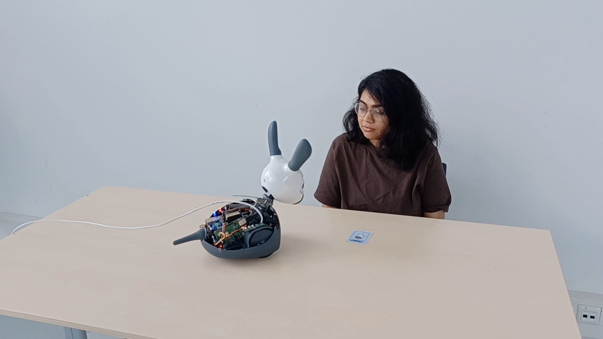

# Case Description

**Group collaborators:** Anna Hornman, Flim de Jong, Liz van Ginderen, Oyindrila Sen Gupta, Sarah Mans

---

## Context and Deployment Setting

MiRo-E is a social robot, in our case, used to support student wellbeing in university study environments. The deployment context is a university study hall — a shared, semi-public space where students engage in extended periods of independent work. These spaces are characterised by self-regulated behaviour and varying levels of stress and focus throughout the day.

The central design challenge is not task assistance but social and emotional support like how can a robot be present in such a space in a way that feels appropriate, non-intrusive, and genuinely beneficial?

*Figure 1: A student and MiRo-E enacting an interaction scenario during the card-based toolkit session.

---

## User Groups

The **direct users** are students using the study hall for independent work. This group is diverse in terms of stress levels, focus states, working styles, and openness to interaction. A key design insight early in the process was that a single interaction model — such as the robot always approaching proactively — would not be appropriate across all student states. A student who is determined but stuck requires a different response than one who is daydreaming or listening to loud music.

The **indirect users** are student wellbeing coordinators and university management. These stakeholders do not interact with the robot directly but have an interest in whether the robot's presence supports institutional wellbeing goals and whether its behaviour is appropriate for a public study environment.

---

## Design Problem and Motivation

A recurring question during early group discussions was how the MiRo-E robot should initiate, respond to, or avoid interaction in a study environment. Should it approach a student who appears stuck? Should it wait for a signal? Should it respond to proximity or sound cues? The answer depended heavily on the specific situation that is the student's current emotional or behavioural state, the action the robot was considering, and the social norms of the space.

This situational complexity — rather than resolving into a single preferred interaction model — is what drove the group's design direction. Rather than fixing a behaviour set in advance, the group developed a card-based improvisation toolkit (CardsAgainstRobots) that allows designers and students to enact and explore MiRo-E behaviours across a range of interaction scenarios. This toolkit is the primary design contribution documented in this portfolio.

The confirmed research question guiding the group assignment is:

> *"How can a card-based improvisation toolkit support the exploration and evaluation of appropriate MiRo-E robot behaviours for promoting student wellbeing in study environments?"*

---

## The MiRo-E Platform

MiRo-E is a biomimetic, animal-like social robot developed by Consequential Robotics. Unlike humanoid robots such as Pepper or NAO, MiRo-E does not have a face that maps onto human features. Its expressiveness is conveyed through head orientation, ear and tail movement, eye and auditory signals. It is both a constraint and a design opportunity as it avoids the social expectations that come with humanoid form while requiring more deliberate design of each expressive modality.

The decision to use MiRo-E in a student wellbeing context brings questions of appropriateness and legibility — whether students can read the robot's intentions and whether its presence feels supportive rather than surveillance-like.

---

## Literature

The following publications directly inform the case and are discussed where relevant throughout this portfolio.

**Geva, N., Uzefovsky, F., & Levy-Tzedek, S. (2020).** Touching the social robot PARO reduces pain perception and salivary oxytocin levels. *Scientific Reports.* — Supports the case for animal-like robots in stress and wellbeing contexts; relevant to the MiRo-E's non-humanoid form as a design choice.

**Rabbitt, S. M., Kazdin, A. E., & Scassellati, B. (2015).** Integrating socially assistive robotics into mental healthcare interventions. *Clinical Psychology Review.* — Frames the broader context of social robots in mental health and wellbeing support; informs the indirect user framing (wellbeing coordinators).

**Shibata, T., & Wada, K. (2011).** Robot therapy: A new approach for mental healthcare of the elderly. *Gerontechnology.* — Adjacent precedent for robot-assisted emotional support; used to critically examine what transfers and what does not in a student context.

**Shi, C., et al. (2022).** A Multimodal Adaptive Framework for Social Interaction with the MiRo-E Robot. *Sensors, MDPI.* — Directly relevant to the MiRo-E platform's multimodal capabilities; informs the behaviour design discussions.

**Cross, E. S., et al. (2012).** MiRo: Social Interaction and Cognition in an Animal-like Companion Robot. *ResearchGate.* — Core reference for MiRo-E's design rationale and social interaction affordances.

**Adjacent fields:**

**Dyrbye, L. N., et al. (2006).** Systematic review of depression, anxiety, and other indicators of psychological distress among U.S. and Canadian medical students. *Academic Medicine.* — Grounds the student wellbeing framing in empirical literature on academic stress; adapted here to the university student population broadly.

**Lazar, A., et al. (2016).** Rethinking the design of robotic pets for older adults. *ACM DIS.* — Service design perspective on robot presence in institutional environments; informs thinking about how DonE fits into the study hall as a shared space.

**Thaler, R. H., & Sunstein, C. R. (2008).** *Nudge: Improving Decisions About Health, Wealth, and Happiness.* Yale University Press. — Introduces the nudge framework from behavioural economics; relevant to designing robot interventions that are non-intrusive and preserve student autonomy.

**Kahneman, D. (2011).** *Thinking, Fast and Slow.* Farrar, Straus and Giroux. — Informs the framing of student cognitive states (focused, distracted, stuck) that the card toolkit is built around.

**Cooper, C. L., & Dewe, P. (2004).** *Stress: A Brief History.* Blackwell. — Provides theoretical grounding for the stress and recovery model underlying the wellbeing framing of DonE.
