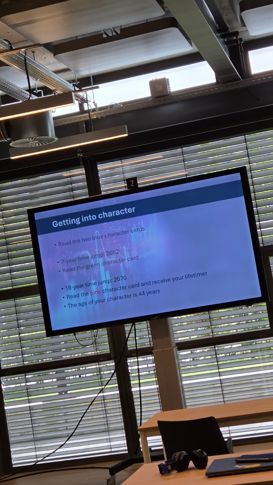
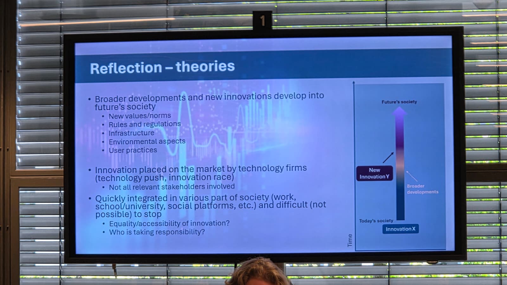
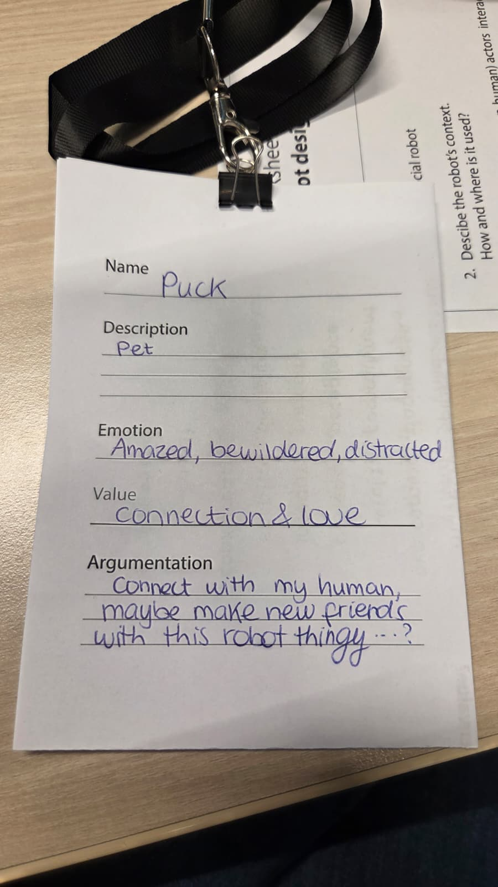
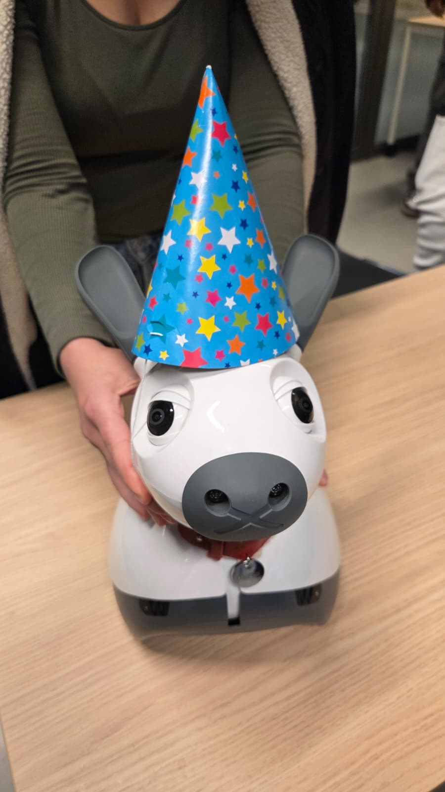

# Embodiment – Session 4

*Group work – Session 4*  
*Collaborators: Anna Hornman, Flim de Jong, Liz van Ginderen, Oyindrila Sen Gupta, Sarah Mans, Nelaturi Kamalini Saugandhika*

---

## Context

Embodiment is about more than what a robot looks like — it is about what a physical presence *affords*. A robot's size, shape, material, and form determine how close people will approach it (proxemics), what they expect it can do, and whether they feel a genuine social presence rather than talking to a screen. The lecture drew on Hall's proxemics theory, Norman's affordances, and empirical work on co-presence to make this point: the body is not decoration, it is argument.

For our case — a MiRo-E robot checking in on students during study sessions — embodiment choices are not neutral. MiRo's dog-like, animal-shaped, tabletop scale directly shapes the kind of interaction it invites: low-stakes, approachable, non-intrusive. That is intentional, and this session gave us tools to reason about it more rigorously.

---

## In-Class Exercise: EduLARP

The session used an **EduLARP** (educational live-action roleplay) format — each group member was assigned a character card representing a different stakeholder interacting with the robot, then navigated time-jumps to 2052 and 2070 to explore how the robot's role and context evolves.

The exercise pushed us to inhabit perspectives we do not usually centre in design: not just the student user, but also the teacher, the parent, and even the pet. One of our character cards was **Puck** — a pet, with the emotion "amazed, bewildered, distracted" and the value "connection and love."

That sounds whimsical, but it raises a genuine design question: the robot occupies physical space in a room with multiple non-human and non-primary actors. A robotic presence that a pet reacts to is a robotic presence that has *actual physical presence* — not a screen, not a voice assistant. The embodiment is doing work.

---

## Group Worksheet: DonE

Our group's robot in this exercise was **DonE** — our MiRo-E case.

Key outputs from the worksheet:

**Robot context:** Students aged 18–25+, during study sessions. Functions mapped include relaxing, pep-talk encouragements, well-being check-ins, reminders, task management, and study time/duration tracking. Social encouragement was a recurring theme.

**Characters and perspectives explored:**
- Character 1 — "Good student" → encourage study break
- Character 2 — "Bad student" → encourage studying
- Character 3 — Teacher/TA → motivating student
- Character 4 — Parent → feeling supportive, less study-focused interactions with child
- Character 5 — Confusion (digitally illiterate, pet)

**Future scenario — positive effects:** Increased student performance, better mental health of students, less teacher administrative burden.

**Future scenario — negative effects:** Data misuse and privacy issues; nagging (can get annoying).

The nagging risk is particularly relevant to embodiment. A push notification is easy to dismiss. A physical robot that visibly moves toward you or changes its posture to signal urgency is harder to ignore — and that same quality that makes it effective can make it feel intrusive. Physical presence amplifies both the benefit and the risk.

---

## Meeting MiRo

During the session we also got hands-on time with the MiRo-E robot itself.

The party hat was added as a playful embodiment experiment — and it actually illustrates the session's core point well. Adding a single physical accessory changes the perceived character of the robot noticeably. MiRo with a party hat feels festive, celebratory, lower-stakes. The same robot without it reads as a more neutral, observational presence. Form really does define the interaction expectation.

---

## Assignment Work

The assignment for this session had three parts. The group work on these is documented below.

---

### Q1 — Do Most Researchers Still Use Pepper or NAO?

The short answer from our literature scan: yes, predominantly. Research like the PMC autism intervention study, the Science Robotics overview, and the ACM hospitality work all default to Pepper or NAO — not because these are optimal for the task, but because they are what labs have. The pattern holds across education, healthcare, and hospitality.

There are notable exceptions. Elderly care research gravitates toward the PARO seal rather than humanoids, because the tactile softness and non-threatening scale fits the context better. The Miroka robot appeared in a 2025 HRI paper as an alternative, and assistive robotics work by Broekens et al. used purpose-built platforms.

The conclusion we reached: hardware availability functions as a constraint that quietly shapes what research questions even get asked. When you only have Pepper, you design studies for Pepper.

---

### Q2 — Embodiment Freedom: Morphological Overview

When freed from availability constraints, the design space for a social robot opens up considerably. The following matrix maps available robots across key embodiment dimensions.

| | Animal-ish shaped | Human shaped | Human size | Non-human/non-animal | Smaller size | White plastic | Other colour/material |
|---|---|---|---|---|---|---|---|
| **Animal-ish shaped** | — | | ✓ | | | | |
| **Human shaped** | Miroka | — | | | | | |
| **Human size** | Theme park robots | Any humanoid (1X, Tesla, Unitree) | — | | | | |
| **Non-human/non-animal** | — | — | IDo | — | | | |
| **Smaller size** | iCat, PARO, MiRo, Spritebot, Mini, Maggie | NAO | — | Anki Cozmo | — | | |
| **White plastic** | MiRo | Pepper, NAO | Pepper | IDo | NAO, MiRo | — | |
| **Other colour/material** | iCat (fluffy), PARO (fluffy), Spritebot (feathers) | Miroka (orange) | Miroka | iCat | iCat | | — |

**Suitability analysis for our case (student wellbeing, tabletop, study room context):**

MiRo-E scores well on several dimensions: small enough to sit on a desk without dominating the space, animal-shaped which lowers the social pressure of interaction, soft in appearance which fits a wellbeing context rather than a productivity-enforcement one. The white plastic keeps it non-threatening without being clinical.

What would make a robot *unsuitable* for this case: human-sized humanoids like Pepper would create proxemic tension in a small study space — they occupy the personal zone of someone sitting at a desk. Brightly coloured or highly stylised robots (like Spritebot) might work for children but would feel incongruous in a university study environment.

---

### Q3 — Design Tool Proposal

**State of the art:**

Existing tools span several categories. The open modular face platform (IEEE 2015) lets designers assemble facial feature modules physically. The Shaping Expressiveness paper (arXiv 2025) uses movement-analysis workshops with dancing to help engineers understand expressive range. Makey Makey enables rapid tangible interface prototyping using everyday conductive objects — useful for testing embodied affordances before committing to hardware fabrication.

None of these specifically help a designer reason about *social* robot embodiment from a user expectations perspective — they address form and movement, but not the fit between context, role, and body.

**Our proposals:**

**Dreamworld (AI-generative tool)**
A web-based tool where a designer sketches a structural wireframe of a robot (essentially its skeleton — proportions, appendages, scale relative to a human figure) and a generative AI completes the surface design based on contextual prompts. The key interaction is the skeleton step: forcing the designer to commit to proportions before aesthetics separates structural form decisions from stylistic ones. The generated outputs can be iterated in seconds, the character can be made interactive through animated micro-expressions, and the process is inherently visual — useful for showing stakeholders and getting reaction feedback early. This tool addresses the early divergent phase of design.

**EmbodimentDeck (card game)**
A structured card game with four categories of cards: *Context cards* (where is this robot used?), *Actor cards* (who interacts with it?), *Expectation cards* (what does this person assume a robot can do?), and *Challenge cards* (what goes wrong when form and function mismatch?). Players draw combinations and must design an embodiment that satisfies the constraints or argue why no existing embodiment would work.

Example round: Context = hospital waiting room / Actor = elderly patient / Expectation = "it will understand me" / Challenge = uncanny valley response. The game surfaces expectation-mismatch problems before prototyping, and the card format makes it accessible to non-technical stakeholders in participatory design sessions.

The two tools are complementary: EmbodimentDeck is for early-stage problem framing with stakeholders; Dreamworld is for rapid visual iteration once the design space is narrowed.
