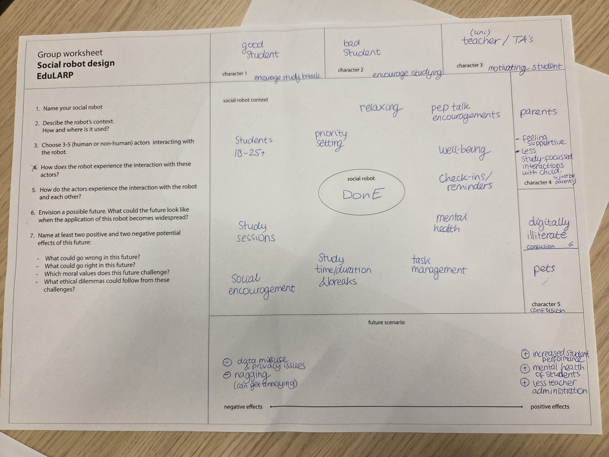

# Ethics and Long-Term Perspective - EduLARP Session 5

---

## Context

Session 5 shifted focus from how the robot should be designed to whether and how it *should exist* at all and what happens when it does, over time. The session was structured around a 
short lecture on ethics, sustainability, and long-term impact, followed by an **EduLARP** (educational live-action roleplay) exercise run by the Saxion Lectorate for Ethics and 
Technology. The EduLARP format is specifically designed to make ethical tensions felt rather than just discussed by inhabiting a stakeholder's perspective, designers encounter 
consequences that a checklist or desk-based analysis tends to flatten out.

---

## The EduLARP Exercise

Each group member was assigned a character card representing a different stakeholder who interacts with or is affected by the robot. The group then navigated two time-jumps: first to 
2052, then to 2070, exploring how the robot's role, relationships, and consequences evolve as it becomes more embedded in everyday life.

*Figure 1: One of the character cards used in the EduLARP exercise - Puck the pet. Assigning a non-human stakeholder perspective forced the group to consider how MiRo-E's physical 
presence registers beyond the primary user.*

*Figure 2: Group worksheet for Miro-E - mapping stakeholder perspectives, robot functions, and positive and negative future consequences across the two time-jumps.*

The characters our group explored included:

- A well-performing student who benefits from structured study reminders
- A struggling student who finds the robot's interventions patronising
- A teacher/TA whose administrative burden decreases but whose relationship with students becomes more mediated
- A parent who feels reassured but gradually less connected to their child's daily experience
- A digitally illiterate or non-primary user (represented by the Puck card) who encounters the robot as part of the physical environment without understanding its purpose

---

## Ethical Tensions Surfaced

The roleplay format made three ethical tensions visible that would likely have been missed:

**1. Making wellbeing dependent on robot presence.** : When participants inhabited the student characters across the time-jumps, it became clear that a robot which successfully 
supports wellbeing also creates a dependency. By 2052, the student who had relied on DonE for study reminders and emotional check-ins had organised their schedule around its presence. 
When the robot was unavailable — due to maintenance, connectivity issues, or university budget cuts - the student experienced disproportionate disruption. Roleplaying this trajectory made
the dependency feel real in a way that listing it as a risk category does not.

**2. Functional dishonesty and expectation mismatch.** : MiRo-E's animal-like form invites a level of social trust and emotional attribution that its actual capabilities do not support. 
During the roleplay, the teacher character noted that students were treating the robot's check-ins as meaningful emotional responses, when the robot was in fact executing scripted 
prompts. The session framing referred to this as *functional dishonesty* - when a robot's designed expressiveness implies capabilities it does not have. For DonE, this is a live design 
tension: the more expressive and socially legible MiRo-E is, the more it risks overpromising.

**3. Data ownership and privacy.** : The robot's wellbeing-tracking functions necessarily involve monitoring - noting when a student has been sitting for a long time, whether they seem 
distracted, whether they have taken breaks. The parent character and the teacher character both raised questions about who owns this data, who can access it, and what happens to it when 
a student leaves the university. Roleplaying from these perspectives made it clear that these are not abstract policy questions - they are felt by specific people in specific 
relationships.

---

## What the Roleplay Format Revealed

A standard ethics checklist for MiRo-E would have identified privacy, dependency, and honest AI as relevant categories and then moved on. The EduLARP did something different; it made 
each tension the lived experience of a specific person over time. The struggling student who finds the robot patronising is not just a risk category; they are someone whose resistance to
the robot is itself a design-relevant signal. The Puck card - a non-human actor who is simply *present* in the space - illustrated that a physically embodied robot affects the social 
ecology of a room in ways that extend well beyond its intended users.

This is the core contribution of the roleplay format - it surfaces *relational* consequences that only become visible when you commit to a perspective and follow it forward in time.
Ethics as a checklist is synchronic - it asks what is wrong right now. EduLARP asks what happens next and to whom.

---

## Relevance to the DonE Design Case

Three ethical issues surfaced in the session are directly relevant to the ongoing design of MiRo-E and are carried forward as constraints into subsequent sessions.

First, the **intrusion/benefit tension**: the same physical presence that makes MiRo-E more effective than a notification also makes it harder to opt out of. Any behaviour design for
MiRo-E must include a clear and low-effort dismissal gesture that the robot recognises and respects without re-approaching immediately. This connects directly to the [behaviour design 
section](behaviour.md).

Second, **honest expressiveness**: MiRo-E's designed expressiveness should not imply emotional understanding it does not have. This means interaction cues should be legible as prompts or
suggestions rather than empathic responses - a distinction that the [expressiveness section](expressiveness.md) addresses at the motion design level.

Third, **data minimisation**: DonE should not log or retain student behaviour data beyond what is needed for the immediate interaction. Any future autonomous implementation would need to
make this explicit to users before interaction begins.

---

## Reflection

The EduLARP was the most uncomfortable session of the course, in a productive way.The Puck card in particular was unexpectedly useful - a pet character has no stake in the robot's 
function, no ability to consent or complain, and no way to make sense of what the robot is. Its presence in the space is simply a fact. That framing reframed the physical embodiment 
question from "what does the robot do for users" to "what does the robot do to the space" - a shift that I think should be part of any robot design process from the start.

An adapted version of this tool for the MiRo-E context specifically would shorten the time-jump distance (2030 is more useful for a university wellbeing context than 2070) and add a 
character card for a student wellbeing coordinator - someone whose professional role is directly implicated by a robot doing part of what they do.

Friedman et al.'s (2008) value-sensitive design framework provides a useful theoretical grounding here: the method specifically advocates for identifying direct and indirect stakeholders
and tracing how a technology's values affect each group differently over time. The EduLARP operationalises exactly this, with the added dimension of temporal projection.

---

**References:**
- Friedman, B., Kahn, P. H., & Borning, A. (2008). Value sensitive design and information systems. *The handbook of information and computer ethics.*
- Verbeek, P.-P. (2011). *Moralizing Technology: Understanding and Designing the Morality of Things.* University of Chicago Press.
