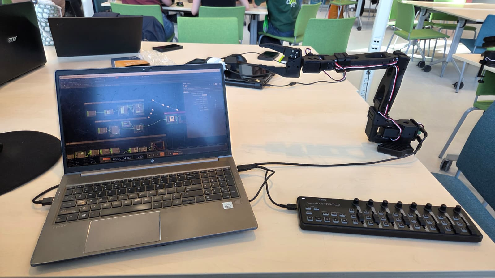

# Expressiveness - TouchDesigner Puppeteering Workshop

*Group work - Session 3*
*Collaborators: Anna Hornman, Flim de Jong, Liz van Ginderen, Oyindrila Sen Gupta, Sarah Mans, Nelaturi Kamalini Saugandhika*

---

## Context

This session introduced TouchDesigner as a tool for puppeteering a physical robot arm (SO-101) via a MIDI controller. The core question was: how do you make a robot feel expressive rather than just mechanically correct?

For our case( a MiRo-E robot with young adults and/or students) expressiveness is not an addition. The robot needs to communicate mood and intent through motion. A hesitant nudge to take a break reads very differently from an abrupt interruption. This session gave us hands-on vocabulary for that design space.

---

## Assignment 1 : Setup & Familiarisation

**What we did:** Connected the SO-101 robot arm to TouchDesigner via USB, loaded the workshop patch, and verified the MIDI controller was correctly mapped. The first 6 sliders on the controls board directly drive the 6 joints of the robot arm through a `fan_robot_angles → robot` operator chain.

**Setup photo:**

*Figure 1: Workshop setup - SO-101 robot arm connected to TouchDesigner via USB, with Korg nanoKONTROL2 MIDI controller used to drive joint angles in real time.*

**Observation:** Direct joint control feels very raw that is, every slider movement translates immediately and literally into a joint angle. There is no smoothing, no personality, no sense of intention. Moving one slider at a time produces stiff, robotic motion that feels nothing like a natural gesture. This is a useful baseline as it makes clear just how much processing is needed before a motion can read as expressive or even comfortable to watch.

---

## Assignment 2b : Trigger Play Animation

**What we did:** Loaded a pre-recorded animation (`backaway_degrees`) and triggered playback using the MIDI play button. The `trigger_play` operator takes a recording and plays it sequentially whenever triggered.

**Observation:** Having a pre-recorded motion that can be triggered on demand immediately changes the feel. The robot moves with a coherent arc rather than a series of disconnected joint jerks. However, playback is always identical - the same pose, the same timing, the same endpoint. This rigidity became obvious quickly. If the robot arm starts from a different resting position, the animation still plays relative to the recorded start, which can look clashing in terms of joint speed. Pre-recorded animation alone is not enough for a robot that needs to respond naturally to a student's context.

---

## Assignment 2c : Expressive Overlay (H / M / L modes)

**What we did:** Inserted the `expressive_overlay` operator between `trigger_play` and `robot`. This operator adds dynamic characteristics (damping and natural frequency) to the motion. The MIDI board's H, M, L buttons switch between three presets - Happy (larger overshoots, bouncy), Sad (slow, heavily damped), and Default (clean motion tracking).

**Observation:** This was the most immediately striking exercise of the session. The same recorded motion felt completely different across modes like the H-mode had an energetic overshoot that read as excitement or eagerness, M-mode felt defeated, L-mode was neutral and precise. What struck us was that the *content* of the motion did not change at all; only its physical character did. This maps directly to our MiRo-E case: the robot checking in on a stressed student should probably not bounce eagerly into their space (H-mode energy), but a very damped, slow approach (M-mode) could read as hesitant and supportive. The operator essentially gives you an emotional filter you can apply on top of any movement.

---

## Assignment 2d : Head Tilt & Manual Override During Animation

**What we did:** Added a `control head tilt` block using `add_overlapping`, which mixes slider-driven manual control of the last three joints with the ongoing animation output. This allows real-time modulation of the robot's "head" posture while an animation plays.

**Observation:** Mixing autonomous animation with live manual control opened up a qualitatively different mode of interaction. The robot could be "running" a sad animation while the operator tilted its head toward a specific point, making the motion feel directed and socially aware rather than just executing a loop. This hybrid - partly scripted, partly responsive, resonates strongly with our Wizard of Oz approach where a human puppeteer can steer the emotional quality of an ongoing motion in real time, without having to pre-program every nuance. For the MiRo-E wellbeing scenario, this suggests a puppeteering model where a researcher controls subtle orientation while pre-recorded behaviours handle the broader gesture.

---

## Assignment 3 : Physical Puppeteering, Recording & Anticipation

**What we did:** Disabled torques on the robot, physically moved the arm by hand to record a custom motion, then re-enabled torques and played it back. The `expressive_overlay` anticipation channel was then used: holding the MIDI square button while the animation plays causes the robot to pull back in the opposite direction before snapping to its target when released.

**Observation:** Physical puppeteering felt the most natural way to generate motion as it bypasses the abstraction of sliders entirely and produces motion that carries the puppeteer's own physical intuition. The anticipation effect was unexpectedly powerful because the pull-back before snapping to target gave the motion a sense of build-up and intention. A robot that "winds up" before doing something feels alive in a way that a robot that simply executes a command does not. For a social robot, this could be valuable like a subtle anticipatory lean before asking a question signals that something is about to happen, giving the user a moment to notice and prepare.

---

## Assignment 4 : Retargeting

**What we did:** Loaded `backaway_degrees.bclip` and used the `retarget_movement` operator to replay the animation adapted to whatever the robot's current joint configuration is at the moment of triggering, rather than replaying from the original recorded start pose.

**Observation:** Retargeting solved one of the key practical problems with pre-recorded animation, the mismatch between the recorded start pose and the actual current pose. With retargeting, the robot could be in any configuration when triggered, and the dynamic character of the animation (its rhythm, the relative joint changes) would still come through cleanly. This is directly relevant for a deployment scenario where a MiRo-E robot in a real study room will not always be in the same pose when it decides to approach a student. Retargeting means the robot's expressive gestures remain consistent regardless of what it was doing before, which is essential for a believable interaction.

---

## What the Tool Made Visible and Its Limits

The most significant contribution of the TouchDesigner workshop was making the *layered structure of expressiveness* legible. Without the node graph, it would have been easy to treat a robot's movement as a single property - either expressive or not. The workshop showed that expressiveness is the product of different separable layers: motion content (what the joints do), physical character (how dynamically they do it), live modulation (what a puppeteer adjusts in response to context) and the timing of it all. Seeing these as distinct operators made it possible to reason about them independently; a conceptual tool that carries over directly into designing MiRo-E behaviour.

The vocabulary of the tool reached its limits in two places relevant to our case. First, the SO-101 arm is humanoid in structure as it has joints that map roughly onto shoulder, elbow, and wrist. Which means Laban-derived concepts such as *directness* (a clear path through space toward a target) and *lightness* (low effort quality) translate relatively naturally. MiRo-E does not have arms. It's expressiveness is distributed across head orientation, ear and tail position, eye colour, and locomotion - a qualitatively different vocabulary. The anticipation and H/M/L concepts transfer in principle, but the spatial and effort qualities cannot be mapped one-to-one. Second, the tool assumes a single puppeteer operating in real time, which worked well for exploration but would not scale to a deployed scenario where the robot must behave autonomously. The workshop gave us expressive vocabulary; it did not give us a method for encoding that vocabulary into autonomous behaviour.

---

## Reflections

Across all four assignments, the clearest takeaway was that **expressiveness is not a property of a single operator as it emerges from the combination of motion content, physical character, timing, and live modulation**. The TouchDesigner node graph made this explicit; you could trace exactly which layer was contributing what, and swap them out. For our MiRo-E design, this suggests thinking in layers - what is the base gesture, what emotional filter does it pass through, and what live adjustments does the puppeteer make in response to the student?

This layered understanding connects to work on non-verbal communication in HRI. Venture et al. (2019) demonstrate that perceived personality and emotional state in robots are driven primarily by movement dynamics like speed, acceleration, and trajectory smoothness, rather than by appearance or speech. The H/M/L mode switching in this session was a direct instantiation of this principle; the same motion trajectory, read as either eager or defeated depending only on its dynamic character. This has a direct implication for this case. A MiRo-E robot approaching a stressed student should be designed at the level of movement dynamics first, not at the level of specific joint targets.

Laban Movement Analysis (LMA), from which the expressive overlay parameters draw conceptually, provides a structured framework for describing these dynamics through the categories of weight, space, time, and flow (Laban, 1950). The damping and natural frequency parameters in the `expressive_overlay` operator can be understood as proxies for LMA's *effort* qualities - bound versus free flow, strong versus light weight. However, as noted above, the translation from LMA to a non-humanoid platform like MiRo-E requires design work that this session did not address. Future work would need to develop a MiRo-E-specific expressive vocabulary that maps LMA effort categories onto the platform's available modalities such as ear position, head tilt, tail movement, and locomotion speed.

---

*All videos recorded during the Social Robot Design workshop, University of Twente, May 2026.*

**References:**
- Venture, G., et al. (2019). Robot expressiveness through motion: A systematic review. *IEEE Transactions on Human-Machine Systems.*
- Laban, R. (1950). *The Mastery of Movement.* Macdonald & Evans.
