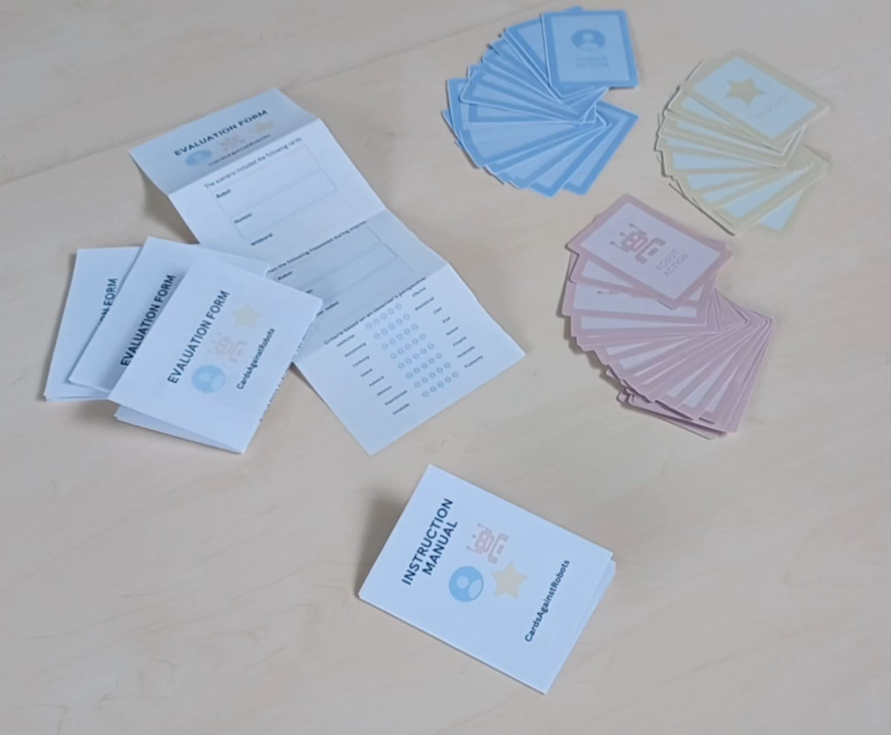
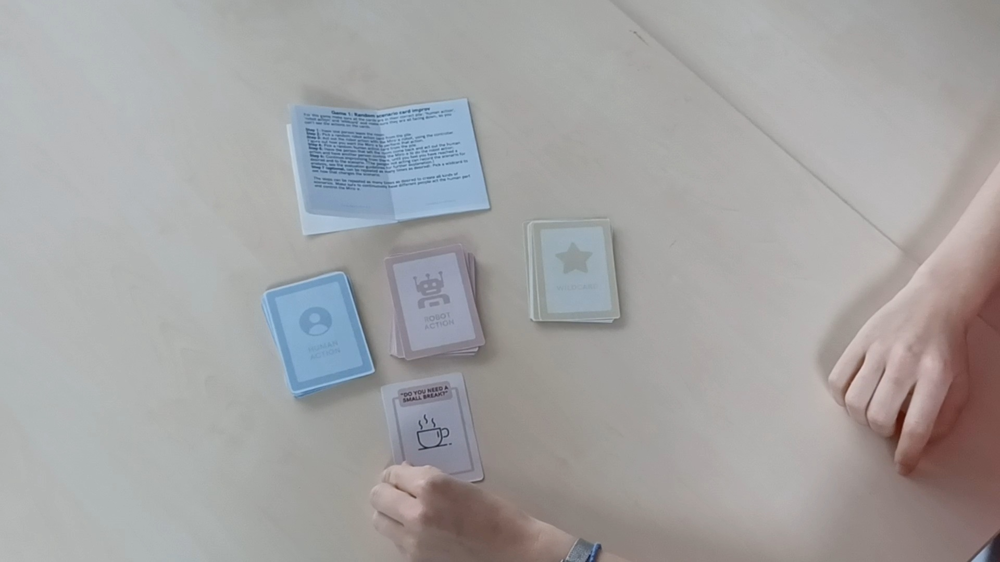
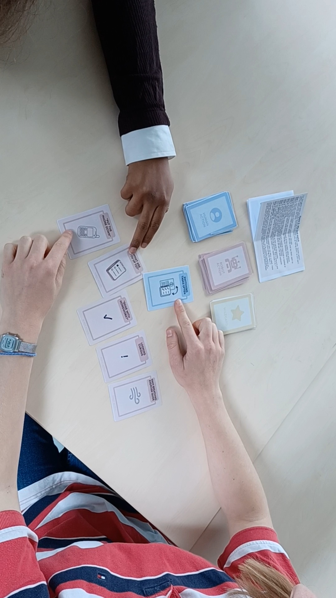
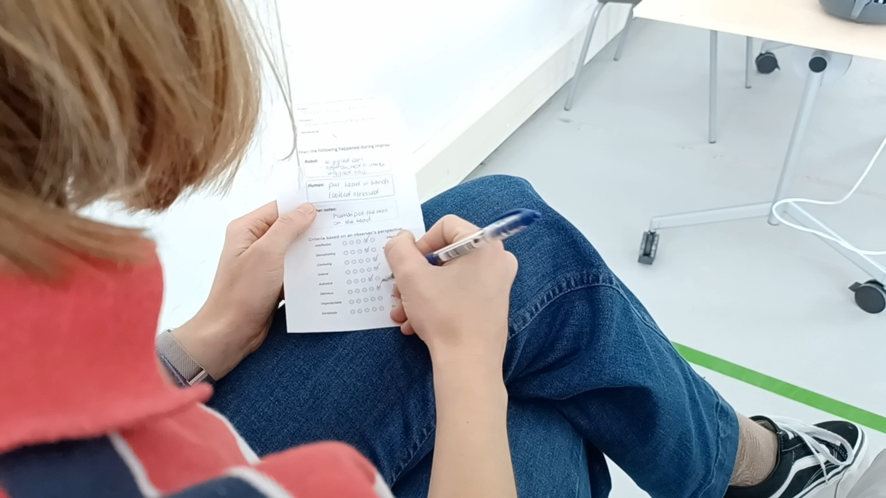

# In-Depth Group Assignment - CardsAgainstRobots

---

## Motivated Direction Choice

The group chose **scenario design** as the in-depth direction, building CardsAgainstRobots into a fully tested, physical toolkit. The motivation came directly from the design case and 
from the design process itself.

From Session 1 onwards, the group was working with a case where the robot's appropriate behaviour was never fixed as it depended on the student's state, the robot's intended action, and 
the social dynamics of the study space. The group had already used scenario analysis, storyboarding, and experience mapping (from the User Innovation Toolkit) in Session 1 to start 
exploring the interaction space. In Session 2, the group developed an Office-style documentary scripting tool to work through two concrete scenarios: a standard wellbeing check-in where 
a student is interrupted during study, and an edge case involving a deaf student where the robot's verbal-only communication model fails completely. Both scenarios revealed the same 
underlying design tension, between helpful intervention and unwanted intrusion and made clear that no single scripted behaviour would hold across the range of student states the robot 
would encounter.

By Session 6, the group had identified that what was needed was not a better script but a tool for *exploring* the space of possible interactions rather than committing to one. Early 
group notes from that session listed several tool directions like flowcharts, ARC software recipes and cognitive walkthroughs, before landing on the card-based improv format, inspired by *Cards Against Humanity* and scripted improv theatre. The core idea was a tool that is structured enough to generate specific scenarios but open enough to let unexpected behaviour 
emerge through enactment with the actual robot.

Scenario design was the right direction because it operates at the level of interaction rather than implementation. It does not require a working autonomous system. It requires a physical robot, people willing to inhabit roles, and a structured framework for capturing what enactments reveal. This extends naturally from LEADOR (Winkle et al., 2021), which advocates for in-situ participatory design where behaviour is explored through live enactment in the actual interaction context, rather than specified at a desk.

---

## Conceptualisation

The conceptualisation phase stretched from Session 1 through Session 6 and drew on three distinct threads of work.

**Thread 1 - Early scenario exploration (Session 1 & 2).** The group selected three tools from the User Innovation Toolkit: Scenario Analysis, Storyboard, and Experience Map. These were 
used to map out the interaction space before any physical prototype existed. The Session 2 work produced two scripted scenarios written in an Office-style documentary format - a structure that allowed characters to break the fourth wall and explain their internal state, making the emotional subtext of the interaction visible. The deaf student edge case was particularly important as it showed that the robot's reliance on verbal communication was a fundamental design gap, not a minor edge case.

The Session 2 script also produced the earliest concrete behaviour specification for MiRo-E. The robot was described as switching between two states every 30 seconds until the student interacted:
State 1: ears forward, light brightening, moving slightly closer 
State 2: ears back, light dimming, moving slightly away 
This state-switching logic anticipated the approach-pause behaviour that later emerged from the card game testing.

**Thread 2 - Hardware and functional grounding (Session 1).** The group mapped MiRo-E's physical capabilities early: actuated eyes, 3DoF neck, built-in speakers, ear and tail movement, 
lights, and wheel-based locomotion. The group also identified what could be Wizard-of-Ozzed - talking, physical expressions, movement and what hardware extensions might be possible like
additional speakers, physiological sensors for heartrate monitoring, accessories like different ears or collars to shift the robot's character. This grounding informed which robot actions would be physically plausible to put on cards.

**Thread 3 - Card concept emergence (Session 6).** The card concept was first sketched in Session 6 group notes as a table with three columns: Human Action, Robot Action, and Wildcards.
Early example cards included "Sits at desk frustrated" / "Goes to desk", "Finally done!" / "Happy move", and "Spills coffee" / "Beeps aggressively." A rejected variant was also tried - one robot card and five human cards. But this did not work because human action always comes first in the timeline of an interaction. The robot reacts to the human, not the other way around. This structural insight shaped the final two-game protocol.

Two game modes emerged at this stage. Game 1 prioritised physical enactment and improvisation. Game 2 prioritised comparative ranking and discussion. Both were designed to be independent of each other.

*Figure 1 (Conceptualisation → Realisation): The printed toolkit showing human action cards (blue), robot action cards (pink), wildcard cards (cream), instruction manual, and evaluation 
forms. The colour coding and card variety reflect multiple iterations from the original rough sketches.*

---

## Physicalisation

The physicalisation phase involved printing the cards, producing the instruction manual, designing the evaluation form and guidelines, and writing the puppeteering guidelines. Session 8 
group notes document the full booklet plan: game guidelines, evaluation guidelines, evaluation form, and guidance on using evaluation results; all brought together in a single physical
booklet.

**Cards:** The initial card set from Session 6 was small and lacked variety. The set was significantly expanded between the first draft and the final version to cover a wider range of 
student states and robot actions. Human Action cards include states like daydreaming, determined but stuck, frustrated and stuck, distracted by phone, listening to loud music, and 
productive but off-task. Robot Action cards include verbal prompts ("Do you need a small break?", "What are you up to?", "Done with homework?") and physical cues ("Looking curious"). The
card visual design was handled by Liz van Ginderen, with colour coding and iconography making card type immediately legible.

Here are all the cards used:

## Human Actions:

## Robot Actions:

## Wildcards:

# 

**Instruction manual:** Covers setup, both game protocols step by step, and a note that the two games can be played in any order.

**Evaluation form and guidelines:** Designed by me and Oyindrila Sen Gupta, grounded in HRI CUES (Cuadra et al., 2024). The form records which cards were used, what 
happened during enactment, and observer ratings across eight criteria on a 1–5 scale: effective, motivational, clear, kind, natural, empathic, predictable, and trustworthy. The 
guidelines specify observer behaviour in three phases - before the scenario (note the cards, prepare the form), during (observe what is visibly played, do not rate yet), and after 
(recollect, go through all criteria, rate based on what was seen not what could have been better). A QR code links to a printable PDF of additional forms so the toolkit can be used 
repeatedly.

**Puppeteering guidelines:** Written to ensure consistent and legible MiRo-E operation - smooth stick movements, staying in character, improvising where appropriate, being open to 
different interpretations.

**Poster:** Designed by me and Liz van Ginderen. Planning notes from Session 8 specified that the poster should show example cards, use the same visual style as the card 
set, and clearly display case, tool structure, game explanation, and evidence of application with images of the tool in use.

**Video:** Planning notes from Session 8 specified four content sections within a five-minute format - challenge framing, tool demonstration, failure modes, and evaluation - with a 
maximum of 75 seconds per section. The failure modes section was planned around the wildcard mismatch issue, the limited number of printed evaluation forms (resolved by the QR code), and 
the cable-tethered MiRo-E constraint. The video was produced collaboratively by the group.

*Figure 2 (Physicalisation - tool in use): Game 1 being played with the printed cards and actual MiRo-E robot. The cable connecting MiRo-E to the laptop is visible - a physical 
constraint that shaped the testing conditions.*

---

## Test Plan and Method

The toolkit was tested at the University of Twente Design Lab with four to eight participants using the actual MiRo-E robot. Both game modes were tested in sequence.

**Protocol:**
- One person puppeteered MiRo-E via game controller throughout.
- Two to three people took turns enacting the student role.
- Remaining participants acted as observers, each holding an evaluation form.
- Game 1 ran first: blind card draws, enactment, optional wildcard introduction.
- Game 2 followed: one human card drawn, five robot cards laid open, ranking discussion, optional wildcard and enactment.
- After each enacted scenario, observers completed the evaluation form independently before discussing ratings aloud.

The test plan had not originally included a formal evaluation component. Teacher feedback during Session 7 identified this as the critical gap: the tool was generating scenarios but not 
validating them. As the session notes state, it was functioning as a generative suggestion box rather than a design evaluation tool. The evaluation form was added as a direct response 
and the test was re-run with the updated protocol.

---

## Observations - Tool in Action

*Figure 3 (Tool in action - Game 2): Participants ranking robot action cards during Game 2. The discussion around the ranking was where most of the design insight emerged.*

*Figure 4 (Tool in action - evaluation): An observer completing the evaluation form after a Game 1 scenario.*

**Game 1 - "Overwhelmed by work" + "Do you need a small break?"**

The student participant put their head in their hands. MiRo-E was slowly driven toward them, head raised and turned, ears adjusted. The student watched with curiosity and eventually 
reached out to pet the robot. Observer ratings were moderate on *effective* and *empathic*, lower on *natural*. The critical observation was that MiRo-E retreated immediately after the 
student made contact, leaving the interaction without a closing gesture. The student was left uncertain. This was not a card design problem but a puppeteering and behaviour design 
problem. The robot needs a way to signal that the interaction has ended positively.

**Game 2 - "Switching tasks often" + five robot action cards**

Cards laid open: "Put the phone down", "What are you up to?", "Done with homework?", "Looking curious", and one additional. After discussion, "Done with homework?" was ranked best as it 
felt least intrusive for a student already moving between tasks. The wildcard "Human doesn't like the robot" shifted the ranking: participants reasoned a more direct card like "Put the 
phone down" would work better for a student who had already rejected softer approaches. The discussion itself was the most valuable output; participants articulated explicit criteria for appropriate robot behaviour that they had not stated before drawing the cards.

**Unexpected findings:**

Some wildcard combinations produced no meaningful shift in any scenario and required redrawing. This confirmed that the wildcard set needed pruning - several cards were too abstract to 
change the dynamic of a scene they were introduced into.

Some participants preferred discussion over enactment. In Game 2, the ranking discussion was engaging enough that groups sometimes chose not to act out the final scenario. The tool 
therefore has value at the discussion level even without the physical enactment step - which broadens its applicability to contexts where a physical robot is not available.

---

## Resulting Redesign

Three changes were made to the toolkit as a direct result of testing.

**1. Evaluation form added.** The most significant change - from a purely generative tool to a generative-and-evaluative one. The eight-criteria observer form, grounded in HRI CUES, was 
not part of the original design. It was added after teacher feedback and changed what the tool could produce: not just scenario ideas but structured evidence about which scenarios worked
and why.

**2. Card variety expanded.** The initial set was small and repetitive after a few rounds. More nuanced human states and a wider range of robot responses were added in the final version.

**3. Wildcard set pruned.** Cards that consistently produced no meaningful shift were removed or reworded. The remaining wildcards were kept only if they introduced a genuine contextual 
change.

---

## Evaluation and Reflection

**Design outcome:** The toolkit produced concrete, actionable behaviour insights such as approach with pause, retreat after interaction, the need for a closing gesture - that came from 
enactment rather than design-time reasoning. This confirms the tool's core premise: appropriate social robot behaviour in a wellbeing context is perceived, not just designed, and 
perception requires a body in a room. The robot design was more grounded and more specifically justified after using the tool than before.

**Tool quality:** CardsAgainstRobots is specific enough to be constraining - the three card types and two game modes are not interchangeable with generic scenario planning tools. It is 
usable by non-technical stakeholders, which matters for a wellbeing context where the relevant people are not engineers. It is generalisable: the card structure and evaluation protocol 
could be adapted to a different robot platform or deployment context by replacing card content without changing the methodology.

Its real limitations are three. First, the WoZ puppeteering means evaluation results are partly a function of puppeteer skill, not just robot behaviour design. Second, the cable-tethered MiRo-E could not move freely, which constrained spatial behaviour testing - approach distance, a key variable in a wellbeing context, could not be fully explored. Third, the tool is better suited to exploration and early evaluation than to final design validation.

LEADOR (Winkle et al., 2021) frames CardsAgainstRobots well: it is a pre-implementation participatory design tool that helps surface which behaviours are worth building before any 
programming begins. HRI CUES (Cuadra et al., 2024) grounds the evaluation component in an existing, validated observer-perspective methodology. Together they position the toolkit within 
established HRI design practice rather than as an isolated invention.

---

## Individual Contribution and Reflection

My primary contributions were the evaluation guidelines and evaluation form (with Oyindrila Sen Gupta), supporting the video production, and working with Liz van Ginderen on the poster.

Designing the observer criteria was the part I found the most interesting. The challenge was making criteria specific enough to produce useful data but general enough to apply 
across very different scenarios. The decision to anchor the criteria in HRI CUES rather than inventing new ones was right as it connected the form to existing HRI evaluation methodology 
and made the results interpretable beyond the group's own judgment.

If I were to change one thing it would be the timing of the evaluation component. It arrived as a response to teacher feedback mid-process, which meant it was developed under time 
pressure. Designing the evaluation protocol alongside the card set from the start, rather than as a retrofit, would have produced a tighter integration between what the cards generate 
and what the form is designed to capture.

---

**References:**
- Winkle, K., et al. (2021). LEADOR: A Method for End-to-End Participatory Design of Autonomous Social Robots. *arXiv:2105.01910.*
- Cuadra, A., et al. (2024). HRI CUES: Human-Robot Interaction Conversational User Enjoyment Scale. *arXiv:2405.01354.*
