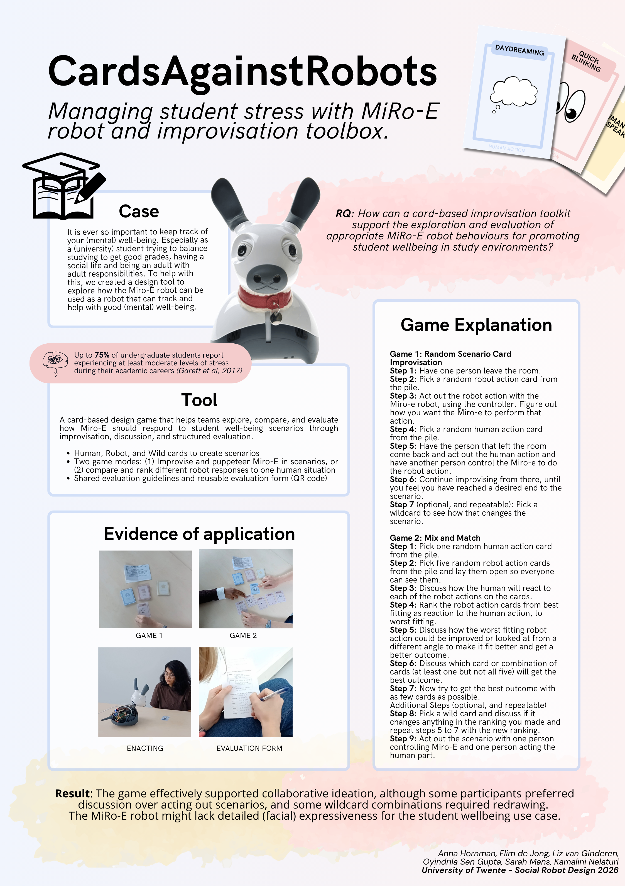

# Poster and Movie : CardsAgainstRobots

**Group collaborators:** Anna Hornman, Flim de Jong, Liz van Ginderen, Oyindrila Sen Gupta, Sarah Mans

---

## Poster

*Figure 1: CardsAgainstRobots poster. The poster presents the case, research question, tool structure, both game modes, evidence of application with photos, and the result of testing.*

The poster was designed to communicate the full project in a single view. The visual hierarchy moves from the case framing and research question at the top, through the tool description 
and game explanation, to the evidence of application section showing photos from the actual testing sessions, and finally to the result statement at the bottom. The three card types are 
showcased in the top right corner to give a reader an immediate sense of the toolkit's physical components.

### Poster Checklist

| Criterion | Met? |
|---|---|
| P1 - Case and tool identifiable in under 10 seconds | ✓ |
| P2 - Tool structure visualised as diagram or annotated image | ✓ |
| P3 - Evidence of application shown with images from testing | ✓ |
| P4 - Result stated explicitly as a labelled element | ✓ |
| P5 - Production quality: clean layout, legible fonts, clear visual hierarchy | ✓ |

### Individual Reflection - Poster

My contribution to the poster was working with Liz van Ginderen on the layout, content and structure. The visual, content and card illustrations were handled by Liz. My input was on 
ensuring the content sections like the research question, the design layout, about the tool and the evidence of application. It is accurate and completely relative to what the testing 
sessions had actually produced.

If I were to change something, it would be the result section. The current result statement is accurate but brief as it reports what happened without explaining *why* it matters for the 
design of MiRo-E specifically. A stronger result would connect the testing outcomes (participants preferring discussion over enactment, the wildcard mismatch issue, MiRo-E's limited 
facial expressiveness) directly back to what those findings mean for future behaviour design. Given the poster format, this would require trimming elsewhere - probably the game 
explanation, which is too detailed for a summary. 

---

## Movie

<iframe width="560" height="315" src="https://www.youtube.com/embed/8XB7BSbQVFU" title="CardsAgainstRobots - Social Robot Design 2026" frameborder="0" allow="accelerometer; autoplay; clipboard-write; encrypted-media; gyroscope; picture-in-picture" allowfullscreen></iframe>

*Video: CardsAgainstRobots - demonstrating the card-based improvisation toolkit for MiRo-E behaviour design. University of Twente, Social Robot Design 2026.*

### Movie Checklist

| Criterion | Met? |
|---|---|
| M1 - Challenge framed in the first 30 seconds | ✓ |
| M2 - Tool demonstrated with actual hardware, not just described | ✓ |
| M3 - At least one failure or unexpected finding included | ✓ |
| M4 - Evaluation speaks to both design outcome and tool quality | ✓ |
| M5 - Production quality: clear audio, stable visuals, 5-minute format respected | ✓ |

### Individual Reflection - Movie

My contribution to the video was as part of the production team. The video follows the structure planned in Session 8: challenge framing, tool demonstration across both game modes, 
failure modes, and evaluation of both the design outcome and the tool itself.

The failure modes section was the most important part to get right. The planned failure where a wildcard does not shift the scenario meaningfully, was a genuine observation from testing 
and not a staged moment. Including it honestly and explaining what the team did with it (note it, redraw) makes the video more credible than a purely polished demonstration would be.

If I were to change something, it would be the evaluation section. The video script noted during planning that the evaluation of design outcome and tool quality was "to be determined when 
games are played." This meant the evaluation section was written after the fact under time pressure. Drafting the evaluation criteria before testing is knowing in advance what we were 
going to measure and why so it would have produced a sharper, more specific verdict in the video rather than a general summary of what went well and what did not.

---

*Both the poster and movie are group deliverables produced collaboratively. Individual contributions are stated explicitly above.*
